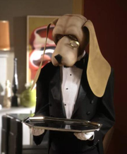

# Barkley - A Discord Butler

  

## Background

_He's a dog and a butler, who wouldn't love him?_ - Jay
Online friendships are hard. Online bestfriendships are even harder. Online romantic relationships are even weirder.
Online, discord has become our little reality.

Presenting - Barkley, the Butler. Barkley is more than a bot, it makes your server your next home.

You are going to either going to love our Barkley or you will find him completely useless, like Gloria does :(

## Features

### DM Style Tags

`.listen @<username>` to listen to a user. When they enter a `.`, you get a ping.
`.ghost @<username>` to prevent the user from tagging you using `.`

`.` - To ghost tag your listeners.

**Why this feature?** Well, this delivers the experience of a DM, but on a server - Badge Icons without the pain of tagging.

### Server Organisation

What lengths one wouldn't go to serve her laziness (cc @varshitakolipaka, the ogre!)

People kinda just end up sending everything in `#general`, it's convenient. What if Barkley can organize and categorize your messages/links/photos/resources/memes/spammmmmmmmmmm in their respective channels and you can just use a keyword and _SWOOOOOOOOOOOOOOOOOOF_ it goes to the right channel.

`.add <keyword>` Type this in a channel of your choice, and now the bot labels your channel using this keyword.

`<keyword> <message>` Type this in any channel, and this message is instead sent to the correct channel (The bot imitates you using a webhook. It's as if you were responsible enough to send the message in the right channel in the first place) (cc @varshitakolipaka, the ogre!)

`<keyword>` Reply to a message with this, and a copy of the original message, including attachments is sent to the correct channel

`<keywords> -` Replying with this to a message will send the original message to the right channel, and delete it from the current channel.

### Server Disguise

_Oh, nononono, mom's here._ (Or maybe your snooping neighbour, meh.)

This is the discord version of stashing away stuff in a closet.

`.j` Type this to get access to all the "ahem ahem" channels.
`.j` Also type this if you wish to revoke the access.

## Barkley at your Service

Excited much?

